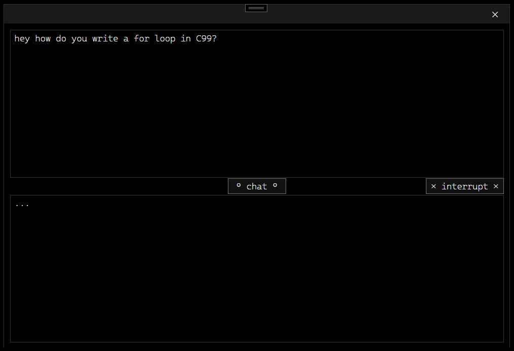

# ONNX Local LLM



- If you're going to change the ONNX model ensure you change all of the associated config `json` to UTF-8 without BOM:
```powershell
$cfg = "C:\...\OnnxLocalLLM\Mistral-7B\genai_config.json"
$text = Get-Content $cfg -Raw
[IO.File]::WriteAllText($cfg, $text, (New-Object System.Text.UTF8Encoding($false)))
```

```powershell
$cfg = "C:\...\OnnxLocalLLM\Mistral-7B\special_tokens_map.json"
>> $text = Get-Content $cfg -Raw
>> [IO.File]::WriteAllText($cfg, $text, (New-Object System.Text.UTF8Encoding($false)))
```

```powershell
$cfg = "C:\...\OnnxLocalLLM\Mistral-7B\tokenizer_config.json"
$text = Get-Content $cfg -Raw
[IO.File]::WriteAllText($cfg, $text, (New-Object System.Text.UTF8Encoding($false)))
```

```powershell
$cfg = "C:\...\OnnxLocalLLM\Mistral-7B\tokenizer.json"
$text = Get-Content $cfg -Raw
[IO.File]::WriteAllText($cfg, $text, (New-Object System.Text.UTF8Encoding($false)))
```
